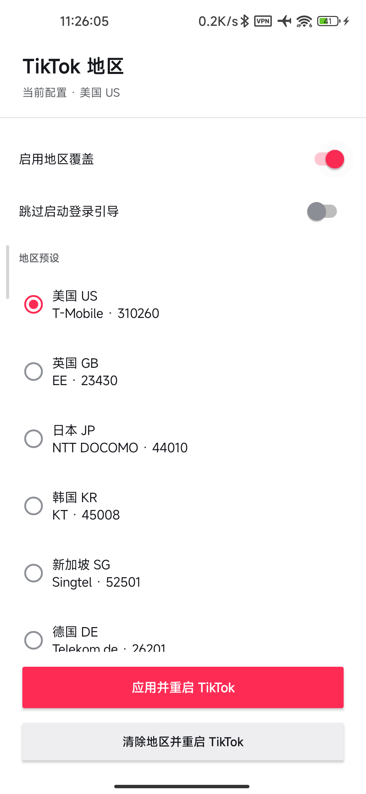
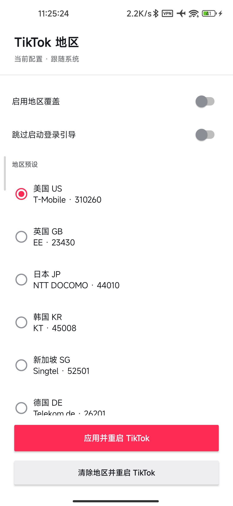

# TikTok Region Hook

[简体中文](README.md) | English

An LSPosed module that provides a consistent set of region, SIM, carrier, and store-region signals inside supported TikTok processes.

Current version: `1.4.1`

## Interface Preview

| Region override enabled | Follow system (override disabled) |
| :---: | :---: |
|  |  |
| TikTok uses the region, SIM, and carrier values supplied by the selected profile. | No region values are overridden; TikTok uses the device's real SIM and system signals. |

## Features

- Region profiles for the United States, United Kingdom, Japan, South Korea, Singapore, Germany, France, Canada, and Australia.
- Consistent country ISO, MCC/MNC, carrier, SIM, system-region, and store-region overrides.
- Supports both `com.zhiliaoapp.musically` and `com.ss.android.ugc.trill`.
- Marks the installed TikTok package as a recommended LSPosed scope application.
- Optionally closes TikTok's dismissible login prompt during a cold start.
- "Apply and restart TikTok" saves the profile, force-stops TikTok, and relaunches it.
- "Clear region and restart TikTok" disables all overrides and restores the real SIM and system signals.
- Caches the effective configuration for TikTok cold starts, so the module application does not need to remain in the background.

## Compatibility

| Item | Status |
| --- | --- |
| Tested TikTok version | Google Play 46.1.3 |
| Tested package names | `com.zhiliaoapp.musically`, `com.ss.android.ugc.trill` |
| Tested Android versions | Android 12, Android 16 |
| Minimum Android version | Android 8.1 (API 27) |
| Runtime environment | Root + LSPosed/Vector |

The module hooks stable Android telephony APIs and version-specific TikTok region providers. TikTok's obfuscated internal classes may change between releases, so a TikTok update can require a module update.

## Installation

1. Prepare a working Root and LSPosed/Vector environment.
2. Download and install the TikTok Region Hook APK from [Releases](https://github.com/kjqg-cn/tiktok-region-hook/releases).
3. Enable the module in LSPosed and confirm that the installed TikTok package is checked and marked as recommended.
4. Open TikTok Region Hook, select a region, and tap "Apply and restart TikTok."
5. When KernelSU or Magisk requests Root access for the first time, grant persistent access so the module can force-stop TikTok.

After updating the module, re-optimize it in Vector/LSPosed when that option is available, then force-stop and reopen TikTok. An in-place update normally preserves Root authorization; uninstalling and reinstalling does not.

## Usage

### Switch regions

Select a profile, keep region overrides enabled, and tap "Apply and restart TikTok." TikTok must be fully restarted before the new signals can take effect consistently.

### Restore the real SIM region

When a SIM from the desired country or region is installed, tap "Clear region and restart TikTok." This stores a disabled state and restarts TikTok without clearing TikTok data. The last selected profile remains visible but inactive.

### Skip the startup login prompt

This option only closes a dismissible login prompt shortly after a new TikTok process starts. It does not bypass account login, verification, or access controls.

## Permissions And Safety

- Root is used only for TikTok `am force-stop` and explicit Activity launch commands.
- The module does not change the system region, system properties, rotation lock, or other global settings.
- Region hooks are installed only in supported TikTok processes.
- The module has no network permission and does not upload configuration or device information.
- This project does not modify or re-sign the TikTok APK.

## Known Limitations

- The module does not replace a working international network route. TikTok may still evaluate IP address, account state, and other server-side risk signals.
- TikTok updates may rename internal obfuscated classes and break version-specific hooks.
- A working feed does not prove that login, user profiles, and every regional endpoint are compatible; perform a complete regression test after updating TikTok.
- Root and LSPosed are required. This solution does not support non-rooted devices.

## Build From Source

Requirements:

- JDK 21
- Android SDK with API 34
- The included Gradle Wrapper

Debug build on Windows:

```powershell
.\gradlew.bat clean lintDebug assembleDebug
```

Linux/macOS:

```bash
./gradlew clean lintDebug assembleDebug
```

A release build requires a local `keystore.properties`. Copy `keystore.properties.example` and fill in your signing configuration. Never commit the keystore, passwords, or `keystore.properties`.

```powershell
.\gradlew.bat clean lintRelease assembleRelease
```

Existing releases must continue using the same signing certificate or Android will reject in-place updates. Publish release APKs through [Releases](https://github.com/kjqg-cn/tiktok-region-hook/releases) instead of committing them to Git.

## Project Layout

```text
app/src/main/java/com/local/tiktokregion/  Module and configuration sources
app/src/main/resources/META-INF/xposed/    Xposed scope metadata
app/src/main/res/                          Android resources
app/libs/api-82.jar                        Xposed API compile-time dependency
AGENTS.md                                  Version adaptation and device test workflow
```

Maintainers should read [AGENTS.md](AGENTS.md) before adapting a new TikTok version.

## License

This project is licensed under the [Apache License 2.0](LICENSE). Copyright (c) 2026 [kjqg-cn](https://github.com/kjqg-cn). Third-party components remain subject to their respective licenses; see [THIRD_PARTY_NOTICES.md](THIRD_PARTY_NOTICES.md).

## Disclaimer

This project is an independent open-source research and device-customization tool. It is not affiliated with, associated with, authorized by, endorsed by, or sponsored by TikTok, ByteDance, LSPosed, Vector, KernelSU, Magisk, or any of their affiliates. TikTok and all related names, trademarks, and logos belong to their respective owners.

This project does not contain, distribute, modify, or re-sign the TikTok APK, and it does not provide TikTok proprietary code, accounts, network proxies, or regional services. It only adjusts selected local runtime return values inside supported TikTok processes installed separately by the user.

You are responsible for ensuring that you are authorized to manage the relevant devices, software, and accounts, and for complying with all applicable laws, TikTok's Terms of Service, Community Guidelines, and other agreements. This project is not intended to bypass payment systems, account verification, access controls, security measures, sanctions restrictions, or to enable unauthorized access. Do not use it where prohibited by law or applicable agreement.

Root access, LSPosed, and runtime hooks can cause application failures, device instability, data loss, privacy or security risks, and may trigger platform risk controls, feature restrictions, account suspension, or bans. Back up important data and understand the technical and account risks before use.

The software is provided “AS IS”, without express or implied warranties of availability, merchantability, fitness for a particular purpose, non-infringement, continued compatibility, regional access, or account safety. TikTok updates, server-side policies, network conditions, and device differences may cause some or all functionality to stop working.

To the maximum extent permitted by applicable law, the maintainers and contributors are not liable for any direct, indirect, incidental, special, punitive, or consequential loss arising from the use, inability to use, misconfiguration, or distribution of this project, including loss of data, device failure, account restrictions, business interruption, or lost profits. Nothing in this disclaimer excludes or limits liability that cannot lawfully be excluded or limited.

By downloading, installing, modifying, distributing, or using this project, you acknowledge and assume the associated risks.
